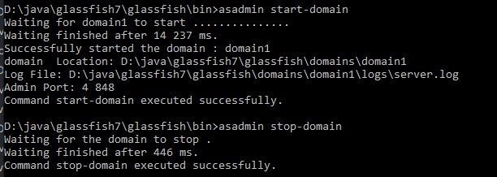
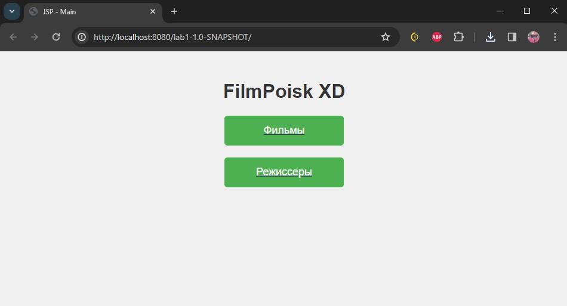
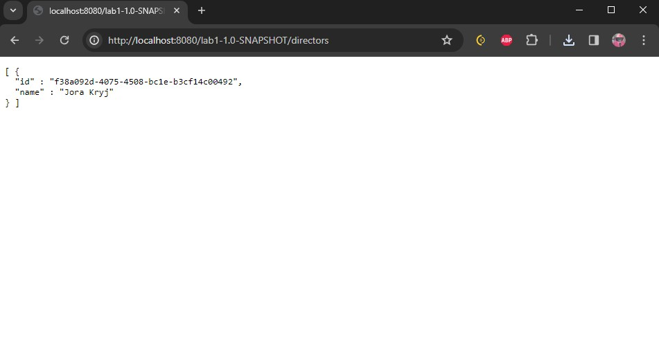
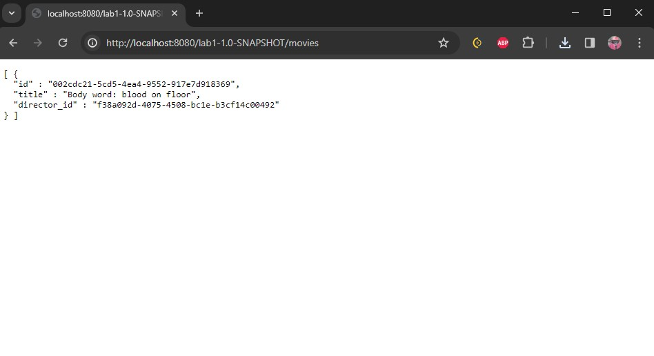

<h1>esa lab 1</h1>

Выполнили студенты группы 6132 Павлов Алексей и Кнестяпин Руслан

<h2>Task 1</h2>

Download GlassFish application server.\
Install it by unpacking the archive.\
Start the application server.\
Open an administrative console and go through its controls.

<h2>Task2</h2>

If you have no DBMS installed, please install one. You can choose any SQL DBMS you like, but PostgreSQL and MySQL are preferred.

PostgreSQL

<h2>Task 3</h2>

1.Choose any subject area and make a model with at least two entities with a few properties.

База данных состоит из 2 таблиц: режиссеры (id, ФИО) и фильмы (id, название, id режиссера). Связь один-ко-многим

2.Create a script to make a database for your model.

[sql](src/FilmPoisk.sql)

<h2>Task 4</h2>

Develop data layer as Java Beans for the model and make them prepared for use with Entity Persistence.

[MovieEntity](lab1/src/main/java/com/example/lab1/models/MovieEntity.java)\
[MovieRepository](lab1/src/main/java/com/example/lab1/repositories/MovieRepository.java)\
[DirectorEntity](lab1/src/main/java/com/example/lab1/models/DirectorEntity.java)\
[DirectorRepository](lab1/src/main/java/com/example/lab1/repositories/DirectorRepository.java)

<h2>Task 5</h2>

Implement business layer for accessing data using session beans.

[MovieService](lab1/src/main/java/com/example/lab1/services/MovieService.java)\
[DirectorService](lab1/src/main/java/com/example/lab1/services/DirectorService.java)

<h2>Task 6</h2>

Implement view layer using any technology of your choice, which is applicable here.

[index](lab1/src/main/webapp/index.jsp)

<h2>Task 7</h2>

| window    | img                       |
|-----------|---------------------------|
| index     |      |
| directors |   |
| movies    |      |
| cat       |        |
| ej        |       |