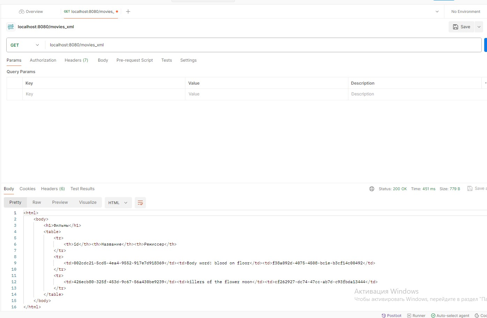
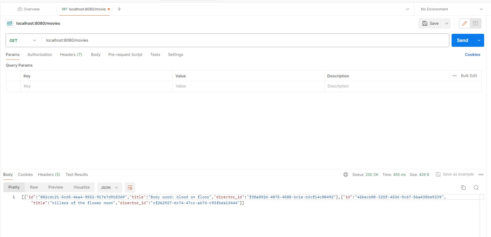
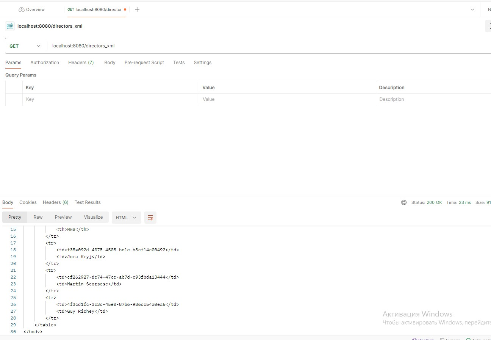
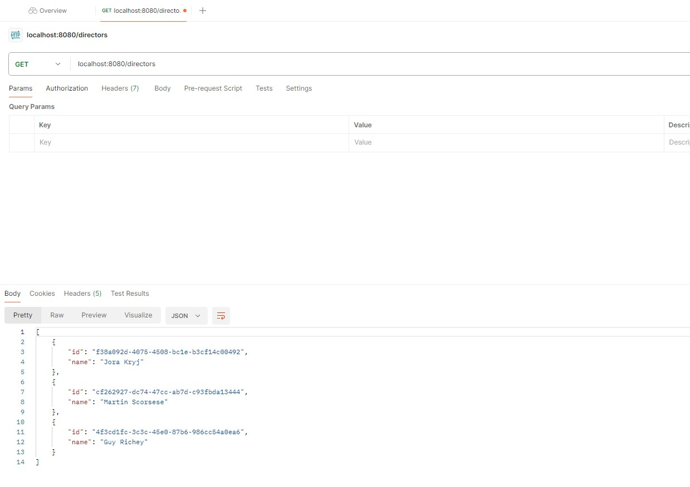

<h1>esa lab 3</h1>
<h2>Выполнили студенты группы 6132 Павлов Алексей и Кнестяпин Руслан</h2>
<h2>Task 1</h2>

Compare JAX-RS and SpringREST. Choose one of them for your application. Give some arguments for your choice.

Выбрали Spring, потому что он популярный и вроде крутой, четкий.

<h2>Task 2</h2>

Choose one of your previous applications for further development.
Develop a REST API for accessing your data.

[controllers](src/main/java/com/example/lab3/controllers)

<h2>Task 3</h2>

Implement the API.
It should allow usage of both XML and JSON.

[WebController](src/main/java/com/example/lab3/controllers/WebController.java)
[DirectorController](src/main/java/com/example/lab3/controllers/DirectorController.java)
[MovieController](src/main/java/com/example/lab3/controllers/MovieController.java)

<h2>Task 4</h2>

Develop an XSL transformation for your XML objects to make a browser able to show them as HTML pages (including object data and navigation to other entities and their lists).

[ObjectToDomTransformer](src/main/java/com/example/lab3/utils/ObjectToDomTransformer.java)

<h2>Task 5</h2>

Add the XSLT to all XML responses.

[directors.xslt](src/main/resources/xmls/directors.xslt)
[movies.xslt](src/main/resources/xmls/movies.xslt)

<h2>Task 6</h2>

Make everything work together…

| window    | img                       |
|-----------|---------------------------|
| movies-xml     |      |
| movies-json |   |
| directors-xml    |      |
| directors-json       |        |

